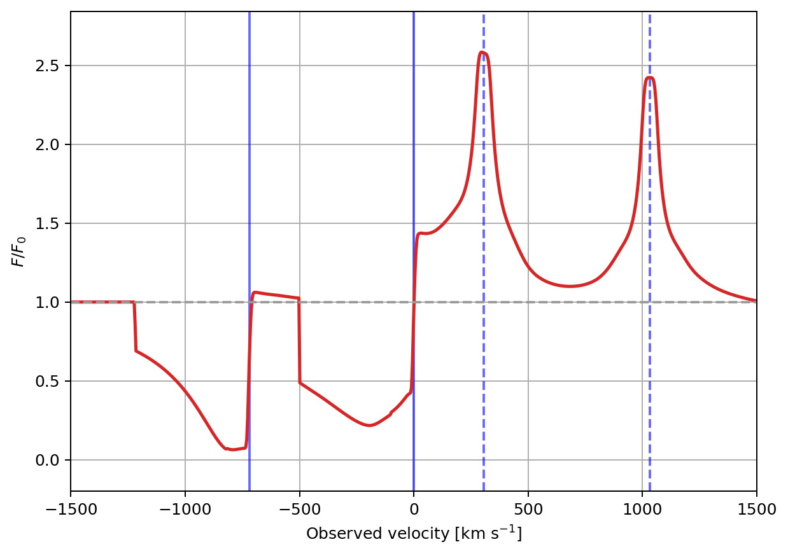
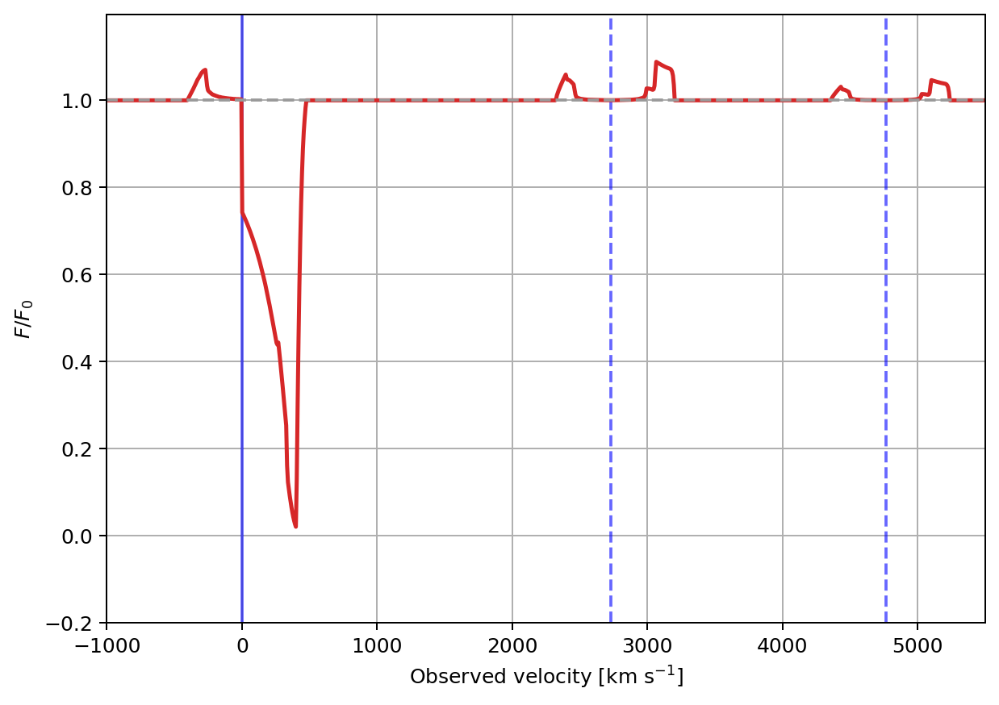

Examples
========

The scripts below are included directly from the repository. They are also
used as numerical smoke tests before release.

Si II turbulent-outflow example
-------------------------------

This example calculates the Si II :math:`\lambda\lambda1190,1193` P-Cygni
profile with its resonant and fluorescent channels.

.. literalinclude:: ../../python/outflow_example.py
   :language: python
   :linenos:

   Output of the turbulent-outflow example. Solid blue lines mark the
   resonant Si II transitions, while dashed blue lines mark the fluorescent
   Si II* transitions.

Fe II inflow example
--------------------

This example calculates Fe II :math:`\lambda2343`, with resonant emission at
2343.49 Angstrom and fluorescent emission at 2364.83 and 2380.76 Angstrom.

.. literalinclude:: ../../python/inflow_example.py
   :language: python
   :linenos:

   Output of the inflow example. The solid blue line marks the resonant Fe II
   transition, while dashed blue lines mark the fluorescent Fe II*
   transitions.
