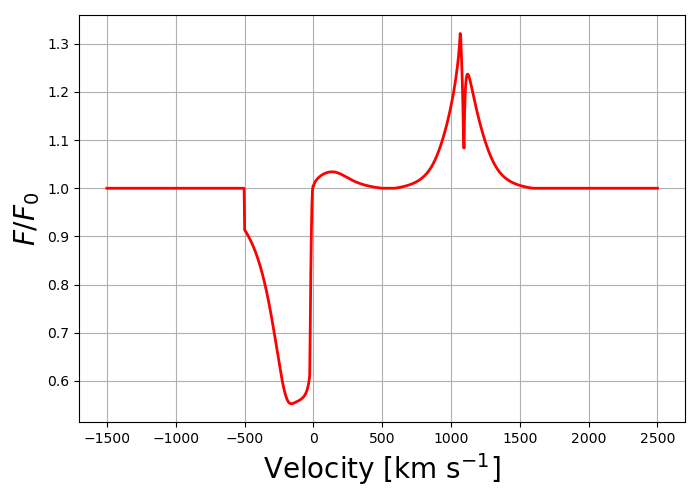

Introduction
============

The semi-analyitcal line transfer (SALT) model is a semi-analytical radiation transfer model designed to predict the spectra of galactic outflows.  This documentation shows how to install and compute SALT.  Examples of different line profile predictions are provided.  In addition, we provide a detailed example showcasing how to fit SALT to a real spectrum.

About the Model
***************

The SALT model was first introduced by Scarlata and Panagia (2015), but has since been modified by Carr et al. (2018,2023).  The 
following documentation is based on the formalism presented in Carr et al. (2023).  While we refer the reader to this paper for 
the details regarding the calculation of the radiation transfer, we provide a physical description of the model and its parameter space here.  All projects which use the SALT model should cite the Carr et al. (2023) paper.

The basic model assumes a spherical source of isotropically emitted radiation which propogates through an expanding medium (i.e., an outflow).  The outflow is characterized by a density field, :math:`n(r)=n_0(\frac{r}{R_{SF}})^{-\delta}`, and velocity field, :math:`v(r)=v_0(\frac{r}{R_{SF}})^{\gamma}`.  The geometry of the outflow is that of a bicone described by an opening angle, :math:`\alpha`, and orientation angle, :math:`\psi`, which can open all the way into a sphere.  A picture of the general model is provided in Figure 1.  In addition, the outflow is assumed to be embedded in a spherical envelope of dust with density which scales with the density of the outflow (see Carr et al. 2021 for a description).  The observational effects of a limiting observing aperture is also considered.  

.. figure:: ../../images/f1.jpg
   :class: with-border

   The model consists of a biconical outflow of opening angle, :math:`\alpha`, and orientation angle, :math:`\psi`, which extends from the surface of the star forming region at radius, :math:`R_{SF}`, to a terminal radius, :math:`R_{W}`.

The SALT model represents a solution to the radiation transfer of resonant photons through the outflow.  In addition, SALT can handle fluorescent emission following resonant scattering (see Scarlata and Panagia 2015 for details).  The next section shows how to compute SALT given various line profiles.  Examples include lines with and without fluorescence.  

Free Parameters
***************

.. list-table::
   :widths: 25 80 25
   :header-rows: 1

   * - Parameter
     - Description
     - Range
   * - :math:`\alpha`
     - half opening angle [rad]
     - :math:`[0,\pi/2.0]`
   * - :math:`\psi`
     - orientation angle [rad]
     - :math:`[0,\pi/2.0]`
   * - :math:`\tau`
     - optical depth divided by :math:`f_{ul}\lambda_{ul}\ [\text{Å}^{-1}]`
     - :math:`[0,\infty)`
   * - :math:`\gamma`
     - velocity field power law index
     - :math:`[0.5,\infty)`
   * - :math:`v_{0}`
     - launch velocity :math:`[\rm km\ s^{-1}]`
     - :math:`(0,\infty)`
   * - :math:`v_{\infty}`
     - terminal velocity :math:`[\rm km\ s^{-1}]`
     - :math:`(0,\infty), \ v_{\infty}>v_0`
   * - :math:`\delta`
     - density field power law index
     - :math:`(0,\infty)`
   * - :math:`\kappa`
     - dust opacity multiplied by :math:`R_{SF}n_{0,dust}`
     - :math:`[0,\infty)`
   * - :math:`v_{ap}`
     - velocity field at :math:`R_{AP}`
     - :math:`[0,\infty)`
   * - :math:`f_c`
     - covering fraction inside outflow
     - :math:`[0,1]`

Using the Model
===============

The SALT model code consists of three python scripts: SALT2022_Absorption.py, SALT2022_Emission.py, and SALT2022_LineProfile.py.  All three scripts can be obtained from GitHub by entering the following command in a terminal window  git clone git@github.com:CodyCarr/SALT.git.  The model can also be accessed by downloading the three scripts from the following documentation.  Working from within the SALT folder, one can run SALT with Python using the following script.  

.. code-block:: python

    # This demo computes the line profile for the Si II 1190, 1193 doublet in a spherical outflow 
		
    import numpy as np
    from SALT2022_LineProfile import Line_Profile

    # SALT parameters
    alpha,psi,gamma, tau, v_0, v_w, v_ap, f_c, k, delta = np.pi/2.0,0.0,1.0,1.0,25.0,500.0,500.0,1.0,0.0,3.0

    # refence wavelength
    lam_ref = 1193.28

    # Observed velocity range centered on lam_ref
    v_obs = np.linspace(-2000,2000,1000)
    
    # Background to be scattered through SALT (this example assumes a flat continuum)
    background = np.ones_like(v_obs)

    # Turn Aperture and Occultation effect on or off (True or False)
    OCCULTATION = True
    APERTURE = True

    # Outflow parameters
    flow_parameters = {'alpha':alpha, 'psi':psi, 'gamma':gamma, 'tau':tau, 'v_0':v_0, 'v_w':v_w, 'v_ap':v_ap, 'f_c':f_c, 'k':k, 'delta':delta}

    # Line Profile parameters
    # abs_waves --> array/list of resonant absorption wavelengths, ordered from shortest to longest
    # abs_osc_strs --> array/list of oscillator strengths :math:`f_{lu}` matching abs_waves in order and number
    # em_waves --> array/list of resonant absorption wavelengths corresponding to each emission wavelength (includes resonance and fluorescence)
    # em_osc_strs --> same as em_waves, but contains the associated oscillator strength for each absorption transition
    # res --> array/list declares which lines in em_waves are resonant (True or False)
    # fluor --> array/list declares which lines in em_waves are flourescent (True or False)
    # p_r --> probability for resonance (see Scarlata and Panagia 2015 for definition)
    # p_f --> probability for fluorescence (see Scarlata and Panagia 2015 for definition)
    # final_waves --> determines all possible wavelengths for emission
    # line_num --> list/array location corresponds to total # of absorption lines, number corresponds to number of emission lines resulting from the corresonding absorption    
    profile_parameters = {'abs_waves':[1190.42,1193.28],'abs_osc_strs':[0.277,.575], 'em_waves':[1190.42,1190.42,1193.28,1193.28],'em_osc_strs':[0.277,0.277,0.575,0.575],'res':[True,False,True,False],'fluor':[False,True,False,True],'p_r':[.1592,.1592,.6577,.6577],'p_f':[.8408,.8408,.3423,.3423],'final_waves':[1190.42,1194.5,1193.28,1197.39],'line_num':[2,2], 'v_obs':v_obs,'lam_ref':lam_ref, 'APERTURE':APERTURE,'OCCULTATION':OCCULTATION}

    #Line_Profile --> output spectrum or line profile
    spectrum  = Line_Profile(v_obs,lam_ref,background,flow_parameters,profile_parameters)

    # plot spectrum in terms of observed velocities
    from matplotlib import pyplot as plt

    fig, ax = plt.subplots(1,1, figsize=(7, 5))
    ax.plot(v_obs,spectrum,'r',linewidth = 2.0)
    ax.set_xlabel('Velocity '+r'$[\rm km \ s^{-1}]$',fontsize =20)
    ax.set_ylabel(r'$F/F_0$',fontsize =20)
    plt.grid()
    plt.tight_layout()
    plt.show()

    
Examples
========

The following is a list of different line profiles predicted with SALT.  

.. code-block:: python

    import numpy as np
    from SALT2022_LineProfile import Line_Profile
    from matplotlib import pyplot as plt
		
    # SiII 1260 singlet (bicone observed edge on)

    lam_ref = 1260.42
    v_obs = np.linspace(-1500,2500,1000)
    background = np.ones_like(v_obs)
    alpha,psi,gamma, tau, v_0, v_w, v_ap, f_c, k, delta = np.pi/4.0,np.pi/4.0,1.0,1.0,25.0,500.0,500.0,1.0,0.0,3.0
    OCCULTATION = True
    APERTURE = True

    flow_parameters = {'alpha':alpha, 'psi':psi, 'gamma':gamma, 'tau':tau, 'v_0':v_0, 'v_w':v_w, 'v_ap':v_ap, 'f_c':f_c, 'k':k, 'delta':delta}
    profile_parameters = {'abs_waves':[1260.42],'abs_osc_strs':[1.22], 'em_waves':[1260.42,1260.42],'em_osc_strs':[1.22,1.22],'res':[True,False],'fluor':[False,True],'p_r':[0.45811051693404636,0.45811051693404636],'p_f':[0.5418894830659536,0.5418894830659536],'final_waves':[1260.42,1265.02],'line_num':[2], 'v_obs':v_obs,'lam_ref':lam_ref, 'APERTURE':APERTURE,'OCCULTATION':OCCULTATION}

    spectrum = Line_Profile(v_obs,lam_ref,background,flow_parameters,profile_parameters)

    fig, ax = plt.subplots(1,1, figsize=(7, 5))
    ax.plot(v_obs,spectrum,'r',linewidth = 2.0)
    ax.set_xlabel('Velocity '+r'$[\rm km \ s^{-1}]$',fontsize =20)
    ax.set_ylabel(r'$F/F_0$',fontsize =20)
    plt.grid()
    plt.tight_layout()
    plt.show()

    
.. code-block:: python

    # SiIII 1206 singlet (dusty sphere)

    lam_ref = 1206.5
    v_obs = np.linspace(-1000,1000,1000)
    background = np.ones_like(v_obs)
    alpha,psi,gamma, tau, v_0, v_w, v_ap, f_c, k, delta = np.pi/2.0,0,1.0,1.0,25.0,500.0,500.0,1.0,10.0,3.0
    OCCULTATION = True
    APERTURE = True

    flow_parameters = {'alpha':alpha, 'psi':psi, 'gamma':gamma, 'tau':tau, 'v_0':v_0, 'v_w':v_w, 'v_ap':v_ap, 'f_c':f_c, 'k':k, 'delta':delta}
    profile_parameters = {'abs_waves':[1206.5],'abs_osc_strs':[1.67], 'em_waves':[1206.5],'em_osc_strs':[1.67],'res':[True],'fluor':[False],'p_r':[1.0],'p_f':[0.0],'final_waves':[1206.5],'line_num':[1], 'v_obs':v_obs,'lam_ref':lam_ref, 'APERTURE':APERTURE,'OCCULTATION':OCCULTATION}

    spectrum = Line_Profile(v_obs,lam_ref,background,flow_parameters,profile_parameters)

    fig, ax = plt.subplots(1,1, figsize=(7, 5))
    ax.plot(v_obs,spectrum,'r',linewidth = 2.0)
    ax.set_xlabel('Velocity '+r'$[\rm km \ s^{-1}]$',fontsize =20)
    ax.set_ylabel(r'$F/F_0$',fontsize =20)
    plt.grid()
    plt.tight_layout()
    plt.show()

    
.. code-block:: python

    # SiIV 1394,1403 (bicone oriented perpendicular to the line of sight)

    lam_ref = 1393.76
    v_obs = np.linspace(-1000,3000,1000)
    background = np.ones_like(v_obs)
    alpha,psi,gamma, tau, v_0, v_w, v_ap, f_c, k, delta = np.pi/4.0,np.pi/2.0,1.0,1.0,25.0,500.0,500.0,1.0,0.0,3.0
    OCCULTATION = True
    APERTURE = True

    flow_parameters = {'alpha':alpha, 'psi':psi, 'gamma':gamma, 'tau':tau, 'v_0':v_0, 'v_w':v_w, 'v_ap':v_ap, 'f_c':f_c, 'k':k, 'delta':delta}
    profile_parameters = {'abs_waves':[1393.76,1402.77],'abs_osc_strs':[.513,.255], 'em_waves':[1393.76,1402.77],'em_osc_strs':[.513,.255],'res':[True,True],'fluor':[False,False],'p_r':[1.0,1.0],'p_f':[0.0,0.0],'final_waves':[1393.76,1402.77],'line_num':[1,1], 'v_obs':v_obs,'lam_ref':lam_ref, 'APERTURE':APERTURE,'OCCULTATION':OCCULTATION}

    spectrum  = Line_Profile(v_obs,lam_ref,background,flow_parameters,profile_parameters)

    fig, ax = plt.subplots(1,1, figsize=(7, 5))
    ax.plot(v_obs,spectrum,'r',linewidth = 2.0)
    ax.set_xlabel('Velocity '+r'$[\rm km \ s^{-1}]$',fontsize =20)
    ax.set_ylabel(r'$F/F_0$',fontsize =20)
    plt.grid()
    plt.tight_layout()
    plt.show()

    
.. code-block:: python

    # CIV 1548.202,1550.772 (sphere limited aperture)

    lam_ref = 1548.202
    v_obs = np.linspace(-750,1000,1000)

    # approximates nebular emission  emitted isotropically from the ISM as two Gaussian profiles centered on the lines
    shift = ((1550.772-1548.202)/(1548.202))*(2.99792458*10**5)
    a,b,c = 2.0,0.0,75
    aa,bb,cc = 1.0,shift,75
    background = a*np.exp(-(v_obs-b)**2.0/(2.0*c**2.0))+1.0+aa*np.exp(-(v_obs-bb)**2.0/(2.0*cc**2.0))

    alpha,psi,gamma, tau, v_0, v_w, v_ap, f_c, k, delta = np.pi/2.0,0,1.0,1.0,25.0,500.0,50.0,1.0,0.0,3.0
    OCCULTATION = True
    APERTURE = True

    flow_parameters = {'alpha':alpha, 'psi':psi, 'gamma':gamma, 'tau':tau, 'v_0':v_0, 'v_w':v_w, 'v_ap':v_ap, 'f_c':f_c, 'k':k, 'delta':delta}
    profile_parameters = {'abs_waves':[1548.202,1550.772],'abs_osc_strs':[0.19,0.0952], 'em_waves':[1548.202,1550.772],'em_osc_strs':[0.19,0.0952],'res':[True,True],'fluor':[False,False],'p_r':[1.0,1.0],'p_f':[0.0,0.0],'final_waves':[1548.202,1550.772],'line_num':[1,1], 'v_obs':v_obs,'lam_ref':lam_ref, 'APERTURE':APERTURE,'OCCULTATION':OCCULTATION}

    spectrum = Line_Profile(v_obs,lam_ref,background,flow_parameters,profile_parameters)

    fig, ax = plt.subplots(1,1, figsize=(7, 5))
    ax.plot(v_obs,spectrum,'r',linewidth = 2.0)
    ax.set_xlabel('Velocity '+r'$[\rm km \ s^{-1}]$',fontsize =20)
    ax.set_ylabel(r'$F/F_0$',fontsize =20)
    plt.grid()
    plt.tight_layout()
    plt.show()

    
.. code-block:: python

    # Mg II 2796.35,2803.53 (bicone oriented face one)

    lam_ref = 2796.35
    v_obs = np.linspace(-1000,1500,1000)

    shift = ((2803.53-2796.35)/(2796.35))*(2.99792458*10**5)
    a,b,c = 2.0,0.0,75
    aa,bb,cc = 1.0,shift,75
    background = a*np.exp(-(v_obs-b)**2.0/(2.0*c**2.0))+1.0+aa*np.exp(-(v_obs-bb)**2.0/(2.0*cc**2.0))

    alpha,psi,gamma, tau, v_0, v_w, v_ap, f_c, k, delta = np.pi/4.0,0,1.0,1.0,25.0,500.0,500.0,1.0,0.0,3.0
    OCCULTATION = True
    APERTURE = True

    flow_parameters = {'alpha':alpha, 'psi':psi, 'gamma':gamma, 'tau':tau, 'v_0':v_0, 'v_w':v_w, 'v_ap':v_ap, 'f_c':f_c, 'k':k, 'delta':delta}
    profile_parameters = {'abs_waves':[2796.35,2803.53],'abs_osc_strs':[0.608,0.303], 'em_waves':[2796.35,2803.53],'em_osc_strs':[0.608,0.303],'res':[True,True],'fluor':[False,False],'p_r':[1.0,1.0],'p_f':[0.0,0.0],'final_waves':[2796.35,2803.53],'line_num':[1,1], 'v_obs':v_obs,'lam_ref':lam_ref, 'APERTURE':APERTURE,'OCCULTATION':OCCULTATION}

    spectrum = Line_Profile(v_obs,lam_ref,background,flow_parameters,profile_parameters)

    fig, ax = plt.subplots(1,1, figsize=(7, 5))
    ax.plot(v_obs,spectrum,'r',linewidth = 2.0)
    ax.set_xlabel('Velocity '+r'$[\rm km \ s^{-1}]$',fontsize =20)
    ax.set_ylabel(r'$F/F_0$',fontsize =20)
    plt.grid()
    plt.tight_layout()
    plt.show()

    
.. code-block:: python

    # Fe II 343.49,2364.83,2380.76 (sphere with Gaussian ISM absorption)

    lam_ref = 2343.49
    v_obs = np.linspace(-1000,6000,2000)

    a,b,c = 1.0,0,75
    background = -a*np.exp(-(v_obs-b)**2.0/(2.0*c**2.0))+1.0
    
    alpha,psi,gamma, tau, v_0, v_w, v_ap, f_c, k, delta = np.pi/2.0,0,1.0,1.0,25.0,500.0,500.0,1.0,0.0,3.0
    OCCULTATION = True
    APERTURE = True

    flow_parameters = {'alpha':alpha, 'psi':psi, 'gamma':gamma, 'tau':tau, 'v_0':v_0, 'v_w':v_w, 'v_ap':v_ap, 'f_c':f_c, 'k':k, 'delta':delta}
    profile_parameters = {'abs_waves':[2343.49],'abs_osc_strs':[.114,.0495,.0351], 'em_waves':[2343.49,2364.83,2380.76],'em_osc_strs':[.114,.0495,.0351],'res':[True,False,False],'fluor':[False,True,True],'p_r':[0.657794676807,0.657794676807,0.657794676807],'p_f':[0.22433460076+0.117870722433,0.22433460076,0.117870722433],'final_waves':[2343.49,2364.83,2380.76],'line_num':[3], 'v_obs':v_obs,'lam_ref':lam_ref, 'APERTURE':APERTURE,'OCCULTATION':OCCULTATION}

    spectrum = Line_Profile(v_obs,lam_ref,background,flow_parameters,profile_parameters)

    fig, ax = plt.subplots(1,1, figsize=(7, 5))
    ax.plot(v_obs,spectrum,'r',linewidth = 2.0)
    ax.set_xlabel('Velocity '+r'$[\rm km \ s^{-1}]$',fontsize =20)
    ax.set_ylabel(r'$F/F_0$',fontsize =20)
    plt.grid()
    plt.tight_layout()
    plt.show()

