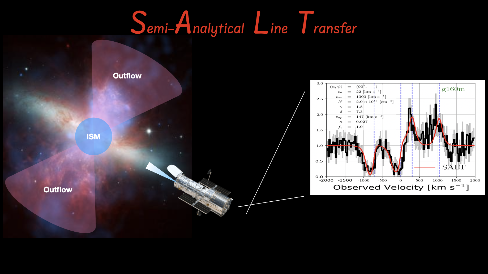

.. semi-analytical line transfer (SALT) documentation master file, created by
   sphinx-quickstart on Mon Feb 27 11:36:47 2023.
   You can adapt this file completely to your liking, but it should at least
   contain the root `toctree` directive.

Overview
========

The semi-analytical line transfer (SALT) model is a semi-analytical radiation transfer model designed to predict the spectra of galactic outflows.  When paired with a Monte Carlo sampler, one can constrain the SALT parameter space to recover the properties of outflows from the absorption+emission lines observed in down-the-barrel spectra.  This includes the density and velocity structure as well as the geometry (i.e., opening and orientation angles) of the outflow.

Support
=======

If you have any issues obtaining or running the code, please consult
the below documentation, or let us know by email (Cody Carr, codycarr24@gmail.com).
We are open to and encourage collaboration.

.. toctree::
   :maxdepth: 2
   :caption: General Usage
   
   general_usage

.. toctree::
   :maxdepth: 2
   :caption: Fitting to Data 
   
   fitting

.. toctree::
   :maxdepth: 2
   :caption: The Code

   modules

.. toctree::
   :maxdepth: 2
   :caption: Resources

Index
=====

* :ref:`genindex`
