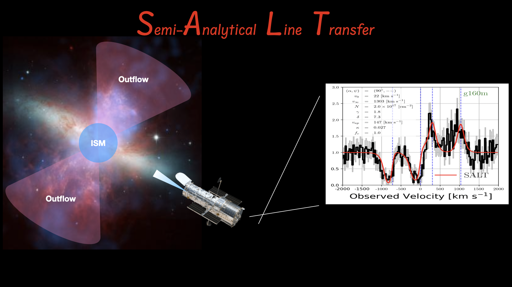

SALT
====

The Semi-Analytical Line Transfer (SALT) model is a radiative-transfer code
for predicting the spectra of galactic outflows and inflows. SALT is a
forward-modeling framework that connects a physical description of a galactic
flow to predicted spectral-line profiles by solving the radiative-transfer
equation under a specified set of boundary conditions. The model accounts for
resonant absorption as well as resonant and fluorescent emission. When fitted
to observations, SALT can constrain the kinematics, geometry, density
structure, and spatial distribution of the flowing gas, along with integrated
quantities such as ionic column densities and mass-flow rates. Tests against
idealized models and cosmological zoom-in simulations have demonstrated SALT's
ability to recover column densities and mass-outflow rates accurately
(< 1 dex) within its validated regimes (Carr et al. 2021, 2025). This tutorial
introduces the code and provides practical examples of calculating line
profiles and fitting SALT models to data.

.. toctree::
   :maxdepth: 2
   :caption: Getting started

   models
   installation
   examples

.. toctree::
   :maxdepth: 2
   :caption: Reference

   parameters
   python_api
   c_api
   numerical

.. toctree::
   :maxdepth: 1
   :caption: Resources

   citations
