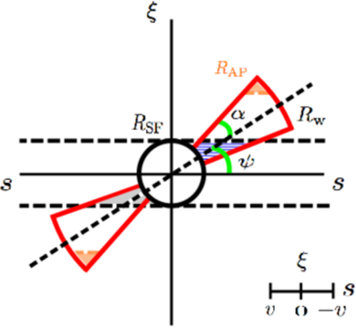
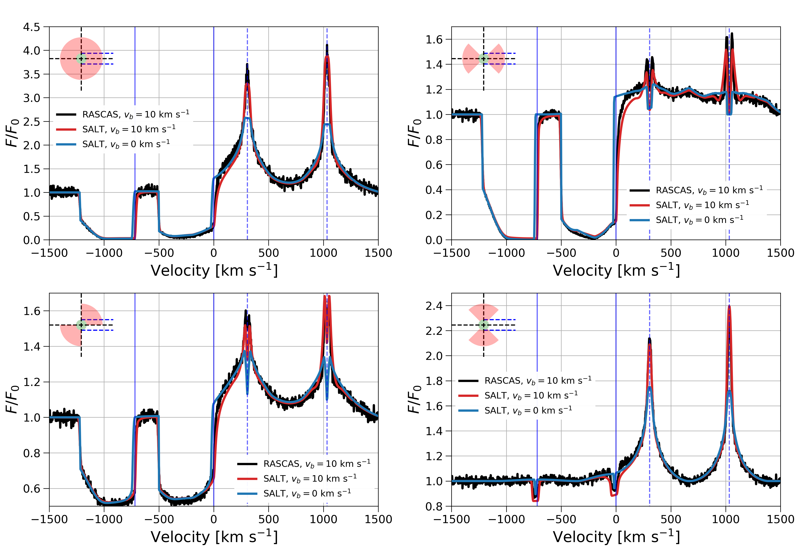
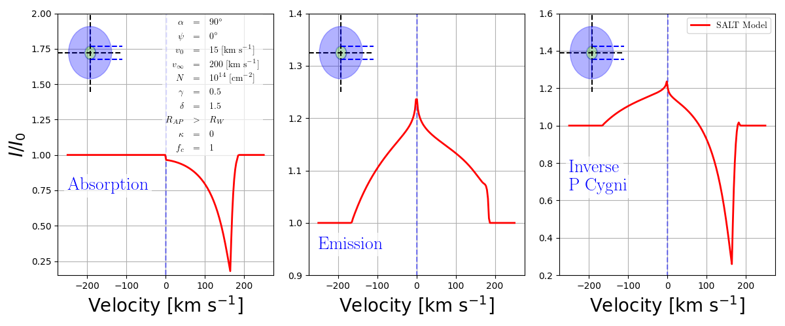

The SALT model
==============

Physical picture
----------------

SALT predicts the continuum absorption and scattered emission produced when
radiation from a central source propagates through a galactic flow. The source
is represented as a sphere of radius :math:`R_{\rm SF}` that emits radiation
isotropically. The surrounding material begins at :math:`R_{\rm SF}` and
extends to a terminal radius :math:`R_{\rm W}`. A circular observing aperture
may truncate the projected flow at :math:`R_{\rm AP}`.

The flow occupies a bicone whose half-opening angle is :math:`\alpha`. The
angle between its symmetry axis and the observer's line of sight is
:math:`\psi`. Setting :math:`\alpha=\pi/2` recovers a spherical flow, for which
:math:`\psi` is irrelevant. The :math:`s`-axis in the schematic is parallel to
the line of sight and :math:`\xi` is perpendicular to it.

   SALT geometry. The emitting source has radius :math:`R_{\rm SF}`; the flow
   extends to :math:`R_{\rm W}` and is sampled through an aperture of projected
   radius :math:`R_{\rm AP}`. The bicone is specified by :math:`\alpha` and
   :math:`\psi`. Adapted from Carr et al. (2018).

Outflows and inflows
--------------------

SALT can model either material accelerating away from the central source or
material falling inward toward it. The two implementations use the same
biconical geometry and density field but adopt different radial velocity
fields. Inflow speeds are supplied to the Python interface as positive
magnitudes; the C dispatcher applies the inward radial direction internally.

Radial structure
----------------

The outflowing velocity field is

.. math::

   v_{\rm out}(r) =
   v_0\left(\frac{r}{R_{\rm SF}}\right)^\gamma.

The inflowing speed magnitude is

.. math::

   v_{\rm in}(r) =
   v_w-v_0\left(\frac{r}{R_{\rm SF}}\right)^\gamma,

with the velocity vector directed toward the source. Both the outflow and
inflow calculations use the same density field,

.. math::

   n(r) = n_0\left(\frac{r}{R_{\rm SF}}\right)^{-\delta}.

Here :math:`v_0` sets the velocity scale, :math:`v_w` is the terminal-velocity
parameter, :math:`\gamma` is the velocity-field index, :math:`n_0` is the
density at the source surface, and :math:`\delta` is the density-field index.
The outer radius differs between the two velocity laws. For the outflow,

.. math::

   \left(\frac{R_{\rm W}}{R_{\rm SF}}\right)_{\rm out} =
   \left(\frac{v_w}{v_0}\right)^{1/\gamma}.

For the inflow,

.. math::

   \left(\frac{R_{\rm W}}{R_{\rm SF}}\right)_{\rm in} =
   \left(\frac{v_w}{v_0}-1\right)^{1/\gamma}.

The normalized optical-depth parameter :math:`\tau` sets the interaction
strength of each transition after multiplication by its oscillator strength
and wavelength. The covering fraction, or wind porosity, :math:`f_c` scales
the fraction of the idealized flow occupied by absorbing material. It is not
the traditional line-of-sight covering fraction, which depends on both
:math:`f_c` and the geometry of the flow. The parameter :math:`k` controls
dust attenuation.

Line formation
--------------

Material projected in front of the source removes continuum photons and forms
the absorption component. Absorbed photons may subsequently escape through
the same resonant transition or through a fluorescent channel. SALT uses the
branching probabilities :math:`p_r` and :math:`p_f` to distribute this
re-emission. Emission from the receding flow can be blocked by the source when
:code:`OCCULTATION=True`. The code accounts for a limiting finite observing
aperture when :code:`APERTURE=True`. The user parameter :code:`v_ap`
represents the velocity at the projected radius of the aperture,
:math:`R_{\rm AP}`.

Model implementations
---------------------

The geometry, density field, and line-formation framework described above can
be evaluated using either the outflow or inflow implementation. The required
:code:`model_type` argument selects the appropriate calculation and prevents
an inflow parameter set from being evaluated inadvertently with the outflow
equations, or vice versa.

Turbulent outflow
^^^^^^^^^^^^^^^^^

Use :code:`model_type="outflow"` for an expanding spherical or biconical
flow. Only the outflow implementation accounts for thermal and turbulent
motions in the wind, which are described by the Doppler parameter
:math:`v_b`. This model supports Voigt absorption, resonant and fluorescent
emission, dust, finite apertures, occultation, and attenuation or re-emission
by neighboring transitions.

To compute the optical depth, the outflow model can use either the libcerf
Faddeeva function (:code:`profile_method="wofz"`) or a faster method based on
a continued-fraction approximation (:code:`profile_method="colt"`). The user
may also force a switch to the Sobolev approximation at the outflow speed
specified by :code:`SW`. See :doc:`numerical` for details of this hybrid
Sobolev/Voigt switch.

   Si II :math:`\lambda\lambda1190,1193` profiles for a sphere and three
   bicone orientations. Black curves show turbulent SALT, red curves show
   RASCAS, and light-blue curves show the original Sobolev SALT model. This
   comparison illustrates how :math:`\alpha` and :math:`\psi` change both
   absorption and re-emission. From Carr et al. (2026).

Inflow
^^^^^^

Use :code:`model_type="inflow"` for the contracting-flow model described by
Carr & Scarlata (2022). This model strictly uses the Sobolev approximation. It
does not accept :code:`v_b`, :code:`Sobolev`, :code:`SW`, or
:code:`profile_method`, and it does not implement transition blending. It
supports dust, finite apertures, source occultation, and resonant or
fluorescent emission. Future work to add turbulent and thermal line broadening
to the inflowing model is being considered, but a timeline has not been set.

   From left to right, the absorption profile, emission profile, and inverse
   P Cygni profile for a spherical inflow. The asymmetry in the emission
   profile reflects source occultation: photons emitted behind the source are
   blocked from the observer's field of view. The model parameters are listed
   in the left panel. From Figure 4 of Carr & Scarlata (2022).

Profile components
------------------

The outflow can return a pure absorption profile, a pure emission profile, or
both. The inflow interface accepts the same profile-component choices. The
:code:`profile_type` argument accepts:

* :code:`"absorption"` for continuum absorption only;
* :code:`"emission"` for scattered emission only; or
* :code:`"pcygni"` for the combined profile.

A complete definition of every input is given in :doc:`parameters`.

Scope
-----

The emission calculation uses the SALT shell-based escape-probability
formalism. It is not a general Monte Carlo solver and does not model
unrestricted spatial and frequency diffusion at very high optical depth.
Consult the model papers for the assumptions and validated regimes.
