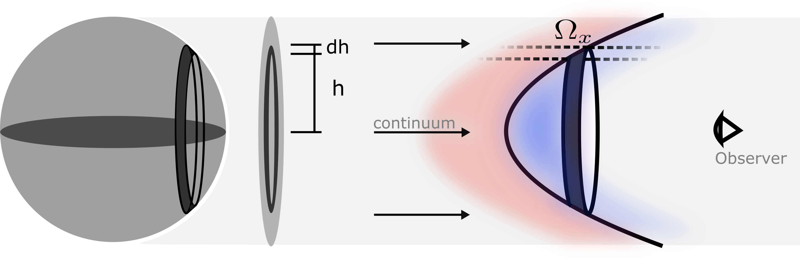

The SALT model
==============

Physical picture
----------------

SALT predicts the continuum absorption and scattered emission produced when
radiation from a central source propagates through a galactic flow. The source
is represented as a sphere of radius :math:`R_{\rm SF}` that emits radiation
isotropically. The surrounding material begins at :math:`R_{\rm SF}` and
extends to a terminal radius :math:`R_{\rm W}`. A circular observing aperture
may truncate the projected flow at :math:`R_{\rm AP}`.

The flow occupies a bicone whose half-opening angle is :math:`\alpha`. The
angle between its symmetry axis and the observer's line of sight is
:math:`\psi`. Setting :math:`\alpha=\pi/2` recovers a spherical flow, for which
:math:`\psi` is irrelevant. The :math:`s`-axis in the schematic is parallel to
the line of sight and :math:`\xi` is perpendicular to it.

.. figure:: _static/images/model_geometry.jpg
   :width: 65%
   :align: center
   :alt: SALT bicone geometry and aperture

   SALT geometry. The emitting source has radius :math:`R_{\rm SF}`; the flow
   extends to :math:`R_{\rm W}` and is sampled through an aperture of projected
   radius :math:`R_{\rm AP}`. The bicone is specified by :math:`\alpha` and
   :math:`\psi`. Adapted from Carr et al. (2018).

Outflows and inflows
--------------------

SALT can model either material accelerating away from the central source or
material falling inward toward it. Select the expanding-flow calculation with
:code:`model_type="outflow"` and the contracting-flow calculation with
:code:`model_type="inflow"`. The two implementations use the same biconical
geometry and density field but adopt different radial velocity fields. Inflow
speeds are supplied to the Python interface as positive magnitudes; the C
dispatcher applies the inward radial direction internally.

Radial structure
----------------

The outflowing velocity field is

.. math::

   v_{\rm out}(r) =
   v_0\left(\frac{r}{R_{\rm SF}}\right)^\gamma.

The inflowing speed magnitude is

.. math::

   v_{\rm in}(r) =
   v_w-v_0\left(\frac{r}{R_{\rm SF}}\right)^\gamma,

with the velocity vector directed toward the source. Both the outflow and
inflow calculations use the same density field,

.. math::

   n(r) = n_0\left(\frac{r}{R_{\rm SF}}\right)^{-\delta}.

Here :math:`v_0` sets the velocity scale, :math:`v_w` is the terminal-velocity
parameter, :math:`\gamma` is the velocity-field index, :math:`n_0` is the
density at the source surface, and :math:`\delta` is the density-field index.
The outer radius differs between the two velocity laws. For the outflow,

.. math::

   \left(\frac{R_{\rm W}}{R_{\rm SF}}\right)_{\rm out} =
   \left(\frac{v_w}{v_0}\right)^{1/\gamma}.

For the inflow,

.. math::

   \left(\frac{R_{\rm W}}{R_{\rm SF}}\right)_{\rm in} =
   \left(\frac{v_w}{v_0}-1\right)^{1/\gamma}.

The optical-depth normalization :math:`\tau` sets the interaction strength of
each transition after its oscillator strength and wavelength are included.
The covering fraction :math:`f_c` scales the fraction of the idealized flow
occupied by absorbing material, while :math:`k` controls dust attenuation.

Line formation
--------------

Material projected in front of the source removes continuum photons and forms
the absorption component. Absorbed photons may subsequently escape through
the same resonant transition or through a fluorescent channel. SALT uses the
branching probabilities :math:`p_r` and :math:`p_f` to distribute this
re-emission. Emission from the receding flow can be blocked by the source when
:code:`OCCULTATION=True`. The code accounts for a limiting finite observing
aperture when :code:`APERTURE=True`. The user parameter :code:`v_ap`
represents the velocity at the projected radius of the aperture,
:math:`R_{\rm AP}`.

In a Sobolev calculation, a photon interacts with a geometrically thin surface
of constant projected velocity, :math:`\Omega_x`. Thermal and microturbulent
motions give that resonance a finite spatial width. The turbulent-outflow
model therefore integrates the optical depth along the photon path through
the wind rather than evaluating it only at the Sobolev surface.

   Under the Sobolev approximation, absorption occurs at the thin black
   surface. Thermal and turbulent motions broaden this into a volume. Red and
   blue regions show gas whose projected velocities lie redward and blueward
   of the nominal Sobolev resonance. From Carr et al. (2026).

Choosing the implementation
---------------------------

The :code:`model_type` argument is required. This prevents an inflow parameter
set from being silently evaluated with the outflow equations, or vice versa.

Turbulent outflow
^^^^^^^^^^^^^^^^^

Use :code:`model_type="outflow"` for an expanding spherical or biconical
flow. This model supports a Doppler parameter :math:`v_b`, Voigt absorption,
resonant and fluorescent emission, dust, finite apertures, occultation, and
attenuation or re-emission by neighboring transitions.

The outflow model can use either the libcerf Faddeeva function
(:code:`profile_method="wofz"`) or the COLT continued-fraction approximation
(:code:`profile_method="colt"`). See :doc:`numerical` for the hybrid
Sobolev/Voigt switch.

Inflow
^^^^^^

Use :code:`model_type="inflow"` for the contracting-flow model described by
Carr & Scarlata (2022). Inflow speeds are supplied as positive magnitudes; the
C dispatcher applies the internal sign convention.

The current inflow model uses the Sobolev approximation. It does not accept
:code:`v_b`, :code:`Sobolev`, :code:`SW`, or :code:`profile_method`, and it
does not implement transition blending. It supports dust, finite apertures,
source occultation, and resonant or fluorescent emission.

Profile components
------------------

The :code:`profile_type` argument accepts:

* :code:`"absorption"` for continuum absorption only;
* :code:`"emission"` for scattered emission only; or
* :code:`"pcygni"` for the combined profile.

A complete definition of every input is given in :doc:`parameters`.

Geometry in the predicted spectra
---------------------------------

.. figure:: _static/images/geometry_profiles.png
   :width: 100%
   :align: center
   :alt: SALT and RASCAS line profiles for four outflow geometries

   Si II :math:`\lambda\lambda1190,1193` profiles for a sphere and three
   bicone orientations. Black curves show turbulent SALT, red curves show
   RASCAS, and light-blue curves show the original Sobolev SALT model. This
   comparison illustrates how :math:`\alpha` and :math:`\psi` change both
   absorption and re-emission. From Carr et al. (2026).

Scope
-----

The emission calculation uses the SALT shell-based escape-probability
formalism. It is not a general Monte Carlo solver and does not model
unrestricted spatial and frequency diffusion at very high optical depth.
Consult the model papers for the assumptions and validated regimes.
