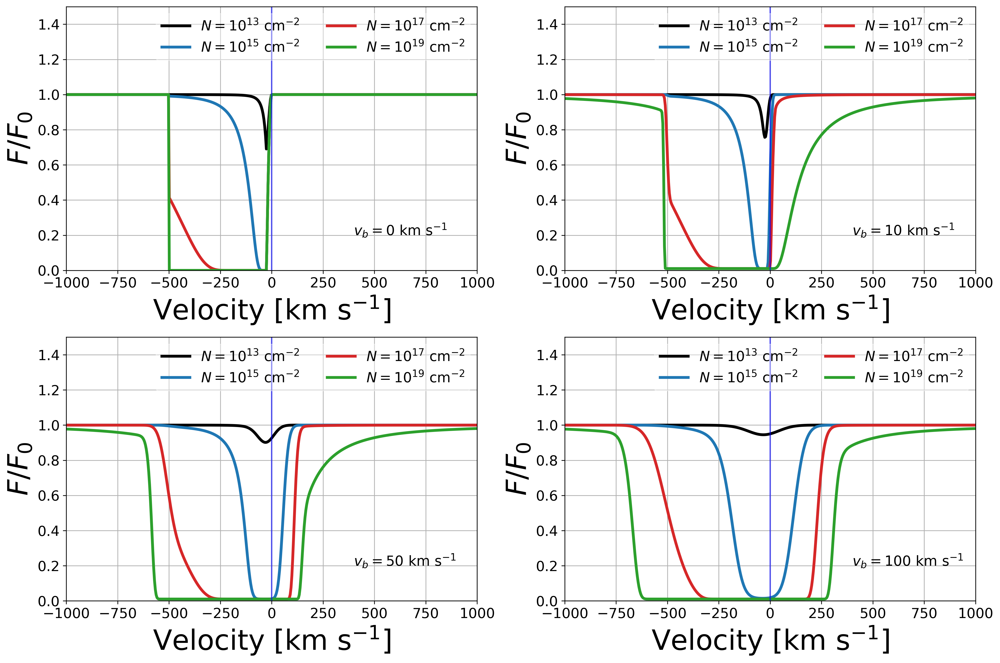

Numerical configuration
=======================

Hybrid Sobolev/Voigt mode
-------------------------

With :code:`Sobolev=True`, the outflow model evaluates the turbulent Voigt
calculation for :math:`|v_{\rm obs}|<SW` and uses the faster Sobolev-limit
geometry outside that interval. :code:`SW` is supplied in km/s. This is a
hybrid mode, not a purely Sobolev calculation.

With :code:`Sobolev=False`, :code:`SW` is not read and may be omitted. The
Voigt calculation is evaluated at every observed velocity and requires
:math:`v_b>0`.

Voigt evaluation
----------------

:code:`profile_method="wofz"` evaluates the Faddeeva function with libcerf.
:code:`profile_method="colt"` uses the continued-fraction approximation
described by Smith et al. (2015, Appendix A1).

Effect of the Doppler parameter
-------------------------------

The Doppler parameter :math:`v_b` controls the Gaussian core of the local
line profile; it is related to the one-dimensional Gaussian dispersion by
:math:`\sigma_v=v_b/\sqrt{2}`. At sufficiently high column density, the
Lorentzian wings also contribute absorption far from line center. The figure
below illustrates both effects relative to the :math:`v_b=0` Sobolev limit.

   Spherical-outflow absorption profiles over a range of ionic column density
   and :math:`v_b`. Increasing :math:`v_b` strengthens absorption near zero
   observed velocity, while high column density makes the line wings
   important. From Carr et al. (2026).

Compile-time resolution
-----------------------

Compile-time grid sizes are centralized in
:code:`include/salt_grid_config.h`. Increasing them generally improves
resolution at the cost of runtime. Any change should be followed by
convergence tests over the intended parameter range.

Benchmarking
------------

The first call may include shared-library, OpenMP, and cache initialization.
For performance representative of fitting or MCMC use, make one untimed
warm-up call and report the median of several subsequent calls, as shown in
the example scripts.
